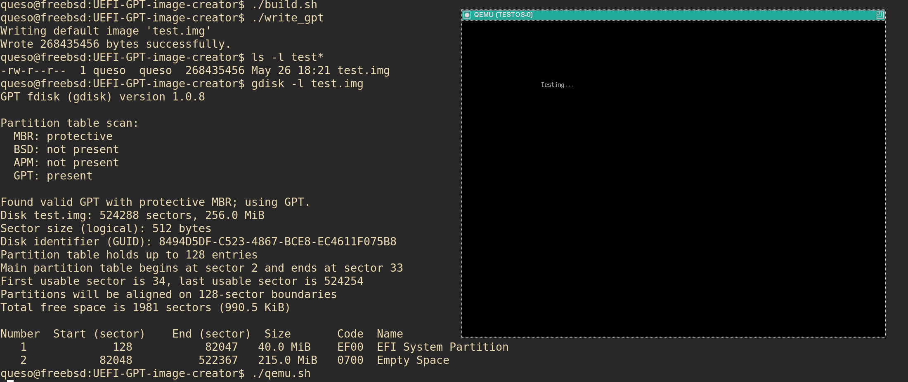

# UEFI-GPT-image-creator
GPT Disk Image Creator for UEFI Development, with EFI System Partition and FAT32 Filesystem

This is a self-contained C program to build a valid GPT disk image file, with FAT32 filesystem containing `/EFI/BOOT/` directory, and optional `BOOTX64.EFI` file.
Purpose is to aid in UEFI development speed, and reduce dependencies on other programs to mount a disk, create a FAT32 filesystem, and move files over.

- Generated disk image files have been tested on both qemu and hardware (Dell XPS13 7390) after writing to a usb drive.

- Verified GPT status of output images with gdisk (gdisk64 on windows) and qemu with OVMF.

- Program Tested on FreeBSD and Windows 10

Currently limited to 256MB in size, with a 40MB EFI system partition, and a 215 MB empty Basic Data partition for use with other developments.

If the file `BOOTX64.EFI` is in the current directory when `write_gpt` is ran, that file will be added to the `/EFI/BOOT/` folder in the ESP.
If that file is not found, `/EFI/BOOT/` will be empty in the created image.

A valid OVMF file for qemu is included as `bios64.bin`. Use it with qemu as `-bios bios64.bin`.

`qemu.bat`/`qemu.sh` is included as an example, change the drive and bios names as needed, as well as any other parms.

## Build
Windows: `build` \
Linux/BSD: `./build.sh` \

## Usage
### Basic:
Windows: `write_gpt [image_name]` \
Linux/BSD: `./write_gpt [image_name]` \

This will write a new image file with the default name 'test.img'.

### Expanded:
```console
[-h --help] [image_name [-ue --update-efi file_name] [-ud --update-data file_name] [-ad --add-data file_name]]
-h --help: Print this message
image_name: Name of output GPT disk image file
-ue --update-efi: Update/overwrite file_name in the /EFI/BOOT/ directory of the EFI system partition
-ud --update-data: Update/overwrite file_name in the basic data partition
-ad --add-data: Add file_name to the basic data partition in a new image file
```

Multi-dash options are aliases for the single dash options i.e. -ue is the same as --update-efi. \
-ad or --add-data will only add `file_name` to a *new* image file. Existing files should use -ud or --update-data instead. \
-ad can not be used with -ue/-ud. \
If no image name is provided, a default 'test.img' file is created. 

## Example

