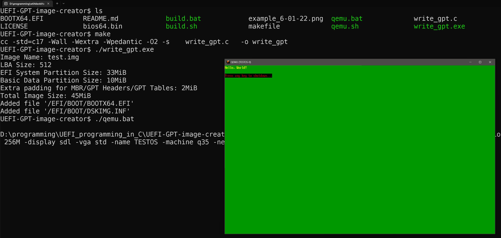
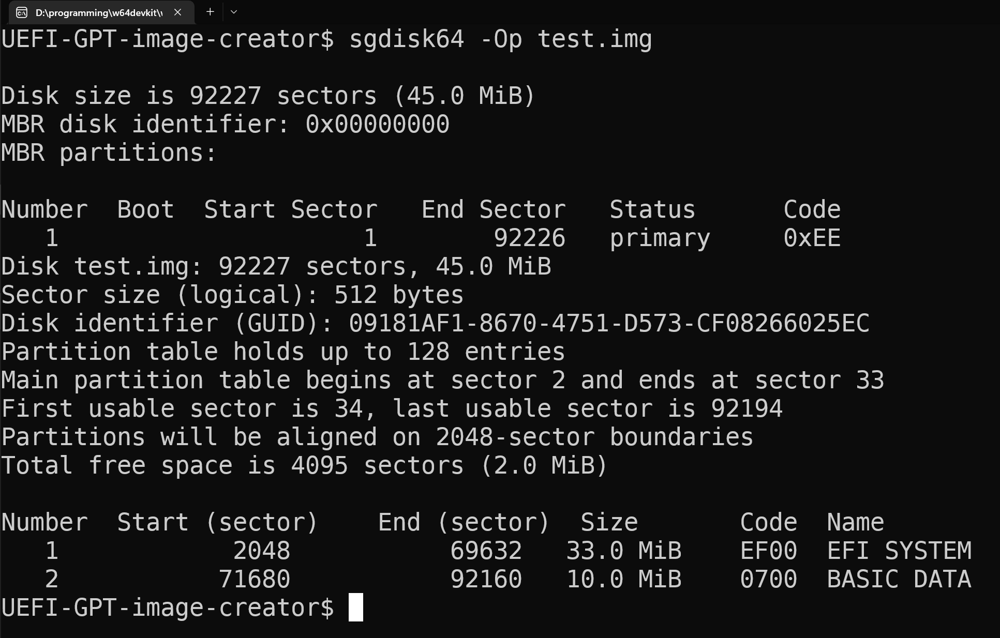

# UEFI-GPT-image-creator
GPT Disk Image Creator for UEFI Development, including EFI System Partition (ESP) with FAT32 Filesystem and Basic Data Partition

This is a self-contained C program to build a valid GPT disk image file, with FAT32 filesystem containing `/EFI/BOOT/` directories, and optional `BOOTX64.EFI` file.
Its purpose is to aid in UEFI development, and reduce dependencies on other programs to mount a disk, create a FAT32 filesystem, and move files into an image.

- Generated disk image files have been tested on both qemu and hardware (Dell XPS13 7390) after writing to a usb drive.

- Verified GPT status of output images with gdisk/sgdisk (gdisk64 on windows) and qemu with OVMF.

The generated image contains an EFI System Partition with FAT32 filesystem with a minimum size of ~33MiB for 512 byte sectors, and an empty Basic Data Partition with a default size of 1MiB.
The data partition can be used to hold a file such as an OS or kernel binary.

The size of both partitions can be changed with command line parameters, see **Usage** section below.

If the file `BOOTX64.EFI` is in the current directory when `write_gpt` is ran, that file will be added to the `/EFI/BOOT/` directory in the ESP.
This file is assumed to be an x86_64 EFI Application, and will be booted automatically in QEMU/OVMF or on UEFI compliant hardware.

A `DSKIMG.INF` file will be created containing the size of the generated image, and added to the `/EFI/BOOT/` directory.

If adding files to the data partition with `-ad <files> --add-data-files <files>`, a `FILE<N>.INF` file will be created for each one containing the file name, size in bytes, and starting lba (disk sector) in the disk image.
These .INF files will be added to the `/EFI/BOOT/` directory in the ESP. The purpose of this is to e.g. find a kernel file for an OS more easily within an EFI application.

A valid OVMF file for qemu is included as `bios64.bin`. Use it with qemu as `-bios bios64.bin`.

`qemu.bat`/`qemu.sh` is included as an example to run the EFI application in the image through emulation; change the drive, bios, and any other parms as needed.

Scripts are provided, assuming packages are installed, to mount and unmount an image file on linux and windows. 
Linux should use `mnt_image_linux.sh` and `unmnt_image_linux.sh`, which use packages `nbd/nbd-client/qemu-nbd`.
Windows should use `mnt_vhd_windows_powershell.ps1`, which uses powershell commands.

**!! Use caution and do not assume any names or volume numbers for partitions, etc. are valid, and run things manually first to ensure you**
**are comfortable running them automatically. You may mess up your disks if you aren't careful. !!**

## Dependencies
C compiler with support for C17 standard or higher (minor changes will be needed if using a standard older than C17), for UTF-16 u"" string literals and uchar.h header.
Tested with gcc and clang.

## Build
- Windows: `build` or `make`
- Linux/BSD: `./build.sh` or `make`

## Usage
### Basic:
- Windows: `write_gpt.exe`
- Linux/BSD: `./write_gpt`

This will create a new image file with the default name `test.img`.

### Expanded:
```console
write_gpt [options]

options:
-ad --add-data-files   Add local files to the basic data partition, and create
                       a <FILE.INF> file for each one under the directory
                       '/EFI/BOOT/' in the ESP. ex: '-ad ../folderA/fileB.txt'.
-ae --add-esp-files    Add local files to the generated EFI System Partition.
                       File paths must start under root '/' and end with a 
                       slash '/', and all dir/file names are limited to FAT 8.3
                       naming. Each file is added in 2 parts; The 1st arg for
                       the path, and the 2nd arg for the file to add to that
                       path. ex: '-ae /EFI/BOOT/ file1.txt' will add the local
                       file 'file1.txt' to the ESP under the path '/EFI/BOOT'
                       To add multiple files (up to 10), use multiple
                       <path> <file> args after the initial -ae flag
                       ex: '-ae /DIR1/ FILE1.TXT /DIR2/ FILE2.TXT'.
-ds --data-size        Set the size of the Basic Data Partition in MiB; Minimum 
                       size is 1 MiB.
-es --esp-size         Set the size of the EFI System Partition in MiB.
-h  --help             Print this help text.
-i  --image-name       Set the image name. Default name is 'test.img'.
-l  --lba-size         Set the lba (sector) size in bytes; This is considered
                       experimental, as tools are lacking for proper testing
                       Valid sizes: 512/1024/2048/4096.
-v  --vhd              Create a fixed vhd footer, and add it to the end of the 
                       disk image. The image name will have a .vhd suffix.
```

-ae/--add-esp-files and -ad/--add-data-files will add files to a *new* image file each time. They do not update an existing images.

## Example


